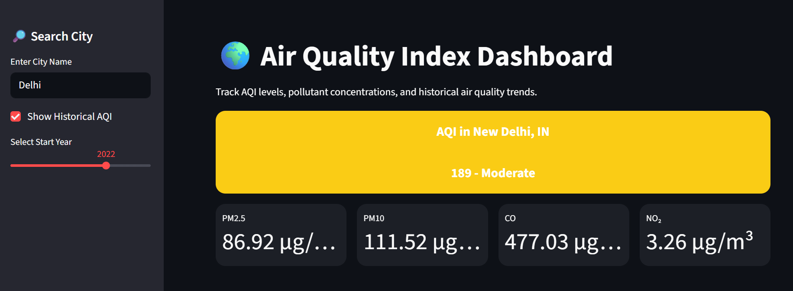
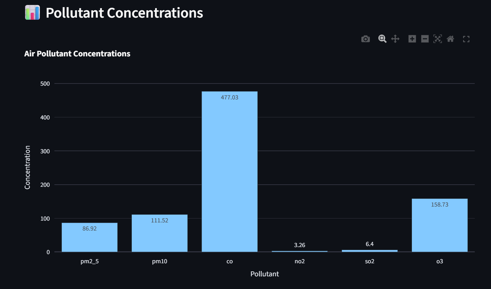
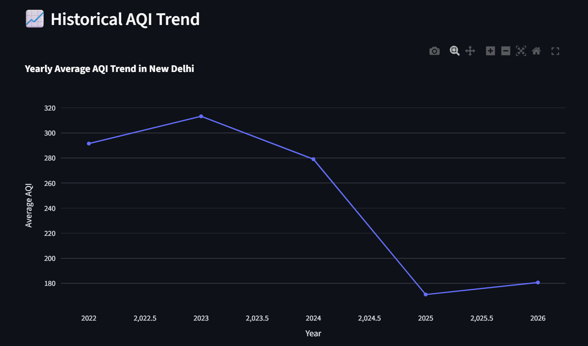

# 🌍 AQI Dashboard using Streamlit

A modern and interactive **Air Quality Index (AQI) Dashboard** built using **Python**, **Streamlit**, **Plotly**, and the **OpenWeatherMap API**.

This project allows users to:

* Check real-time AQI levels for any city
* View pollutant concentrations
* Analyze historical AQI trends
* Visualize pollution data using interactive charts
* Download AQI history data as CSV

---

# 🚀 Live Demo

Add your deployed Streamlit app URL here:

```text
https://your-streamlit-app-url.streamlit.app
```

---

# 📸 Screenshots

## 🏠 Dashboard Home



---

## 📊 Pollutant Concentration Chart



---

## 📈 Historical AQI Trend



---

# ✨ Features

## 🌍 Real-Time AQI Monitoring

Get live AQI information for any city using the OpenWeatherMap Air Pollution API.

---

## 📊 Interactive Data Visualization

Interactive charts built using Plotly for:

* Pollutant concentrations
* Historical AQI trends
* AQI comparisons

---

## 📈 Historical AQI Analysis

Analyze AQI trends over multiple years.

The dashboard calculates yearly AQI averages and displays them using dynamic graphs.

---

## 📥 Export AQI Data

Download historical AQI data as CSV directly from the dashboard.

---

## ⚡ Fast and Optimized

Implemented:

* Streamlit caching
* Error handling
* Optimized API requests
* Efficient data processing

---

# 🛠️ Tech Stack

| Technology         | Usage                     |
| ------------------ | ------------------------- |
| Python             | Core Programming Language |
| Streamlit          | Dashboard UI              |
| Plotly             | Interactive Charts        |
| Pandas             | Data Analysis             |
| Requests           | API Calls                 |
| OpenWeatherMap API | AQI and Pollution Data    |
| Dotenv             | Environment Variables     |

---

# 📂 Project Structure

```text
AQI-Dashboard/
│
├── app.py
├── requirements.txt
├── README.md
├── .env
├── assets/
│   ├── dashboard_home.png
│   ├── pollutant_chart.png
│   └── historical_aqi.png
│
└── .gitignore
```

---

# ⚙️ Installation Guide

## 1️⃣ Clone the Repository

```bash
git clone https://github.com/shivam183-star/AQI-Data-Analytics.git
```

---

## 2️⃣ Navigate to Project Directory

```bash
cd AQI-Data-Analytics
```

---

## 3️⃣ Create Virtual Environment (Optional but Recommended)

### Windows

```bash
python -m venv venv
venv\Scripts\activate
```

### Mac/Linux

```bash
python3 -m venv venv
source venv/bin/activate
```

---

## 4️⃣ Install Dependencies

```bash
pip install -r requirements.txt
```

---

# 🔑 OpenWeatherMap API Setup

## Step 1: Create Account

Visit:

```text
https://openweathermap.org/api
```

Create a free account.

---

## Step 2: Generate API Key

After logging in:

* Open API Keys section
* Generate a new API key
* Copy the key

---

## Step 3: Create `.env` File

Inside project root folder:

```text
.env
```

Add:

```env
API_KEY=your_api_key_here
```

---

# ▶️ Running the Application

Run the Streamlit app:

```bash
streamlit run app.py
```

---

# 📊 AQI Categories

| AQI Range | Category     |
| --------- | ------------ |
| 0 – 50    | Good         |
| 51 – 100  | Satisfactory |
| 101 – 200 | Moderate     |
| 201 – 300 | Poor         |
| 301 – 400 | Very Poor    |
| 401 – 500 | Severe       |

---

# 📌 API Endpoints Used

## 📍 Geocoding API

Used to fetch latitude and longitude from city name.

```text
http://api.openweathermap.org/geo/1.0/direct
```

---

## 🌫️ Air Pollution API

Used to fetch real-time pollution data.

```text
http://api.openweathermap.org/data/2.5/air_pollution
```

---

## 📈 Historical Air Pollution API

Used for AQI trend analysis.

```text
http://api.openweathermap.org/data/2.5/air_pollution/history
```

---

# 🧠 Improvements Implemented

Compared to the initial terminal-based version, this dashboard includes:

* Full Streamlit UI
* Responsive layout
* API validation
* Optimized API requests
* Interactive charts
* Streamlit caching
* Downloadable reports
* Better scalability

---

# 🚀 Future Improvements

Planned upgrades for future versions:

* 🌤️ Weather integration
* 🗺️ AQI heatmaps
* 🌎 Compare multiple cities
* 🤖 AQI prediction using Machine Learning

---

# 🧪 Example Usage

1. Enter city name in sidebar
2. View real-time AQI
3. Analyze pollutant concentrations
4. Explore historical AQI trends
5. Download AQI data

---


# 🤝 Contributing

Contributions are welcome.

If you'd like to improve this project:

1. Fork the repository
2. Create a feature branch
3. Commit your changes
4. Push the branch
5. Open a Pull Request

---

# 📄 License

This project is licensed under the [MIT License](LICENSE).

---

# 👨‍💻 Author

## Shivam Singh

### Connect with Me

- [GitHub](https://github.com/shivam183-star)
- [LinkedIn](https://www.linkedin.com/in/shivam-singh-15b79a31a/)
---

# ⭐ Support

If you found this project useful:

- Give it a ⭐ on GitHub
- Share it with others
- Fork the repository

---
